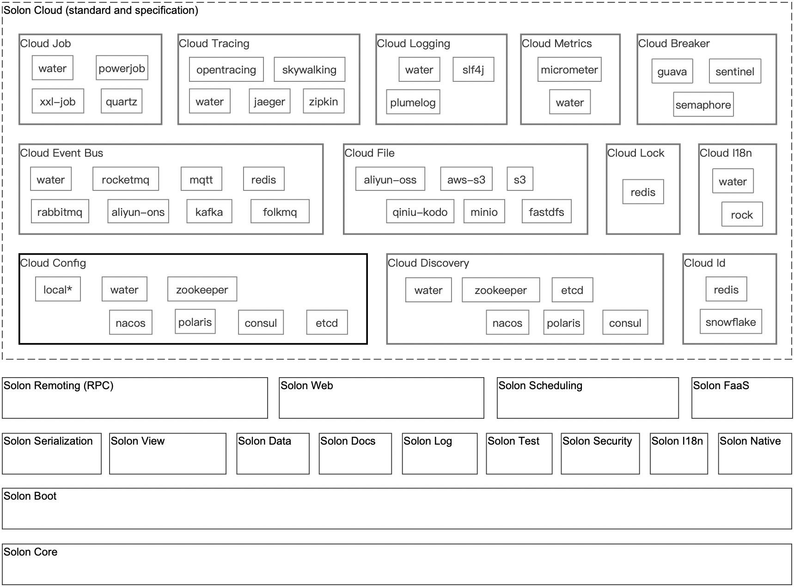

<h1 align="center" style="text-align:center;">

 
Solon v3.5.1
</h1>

	<strong>Java enterprise application development framework for full scenario: Restrained, Efficient, Open</strong>
     
    <strong>[OpenAtom foundation, incubation project]</strong>

	<a href="https://solon.noear.org/">https://solon.noear.org</a>

    
    
    
    
    
    
    
     
    
    
    

##### Language: English | [中文](README_CN.md) | [Русский](README_RU.md) | [日本語](README_JP.md)

700% higher concurrency 50% memory savings Startup is 10 times faster. Packing 90% smaller; It also supports java8 ~ java24, native runtime.
 
Built from scratch, with more flexible interface specifications and an open ecosystem

## Features:

| Feature                                           | Description                                                                                                                               | 
|---------------------------------------------------|-------------------------------------------------------------------------------------------------------------------------------------------| 
| Better cost performance for computing resources   | 700% higher concurrency([techempower](https://www.techempower.com/benchmarks/#hw=ph&test=plaintext&section=data-r23)), 50% memory savings |
| Faster development productivity                   | Less code; Easy to get started; 10x faster startup (faster debugging)                                                                     |
| Better production and deployment experience       | Pack 90% smaller                                                                                                                          |
| Greater range of compatibility                    | Non-java-ee architecture; It also supports java8 ~ java24, graalvm native image                                                           |

## Main code repository

| Code repository                                                   | Description                                               | 
|-------------------------------------------------------------------|-----------------------------------------------------------| 
| [/opensolon/solon](../../../../opensolon/solon)                   | Solon ,Main code repository                               | 
| [/opensolon/solon-examples](../../../../opensolon/solon-examples) | Solon ,Official website supporting sample code repository |
|                                                                   |                                                           |
| [/opensolon/solon-expression](../../../../opensolon/solon-expression)                    | Solon Expression ,Code repository                         | 
| [/opensolon/solon-flow](../../../../opensolon/solon-flow)                    | Solon Flow ,Code repository                               | 
| [/opensolon/solon-ai](../../../../opensolon/solon-ai)                        | Solon Ai ,Code repository                                 |
| [/opensolon/solon-cloud](../../../../opensolon/solon-cloud)                  | Solon Cloud ,Code repository                              | 
| [/opensolon/solon-admin](../../../../opensolon/solon-admin)                  | Solon Admin ,Code repository                              | 
| [/opensolon/solon-jakarta](../../../../opensolon/solon-jakarta)              | Solon Jakarta ,Code repository（base java21）               | 
| [/opensolon/solon-integration](../../../../opensolon/solon-integration)      | Solon Integration ,Code repository                        | 
|                                                                   |                                                           |
| [/opensolon/solon-gradle-plugin](../../../../opensolon/solon-gradle-plugin)  | Solon Gradle ,Plugin code repository                      | 
| [/opensolon/solon-idea-plugin](../../../../opensolon/solon-idea-plugin)      | Solon Idea ,Plugin code repository                        | 
| [/opensolon/solon-vscode-plugin](../../../../opensolon/solon-vscode-plugin)  | Solon VsCode ,Plugin code repository                      | 

## Ecosystem Architecture Diagram:

* solon

* solon cloud

## Official website and related examples, cases：

* Official website address：[https://solon.noear.org](https://solon.noear.org)
* Official website supporting demos：[https://gitee.com/opensolon/solon-examples](https://gitee.com/opensolon/solon-examples)
* Project unit test：[__test](./__test/)
* User case：[User open source project](https://solon.noear.org/article/555)、[User business project](https://solon.noear.org/article/cases)

## Special thanks to JetBrains for supporting open-source projects：

