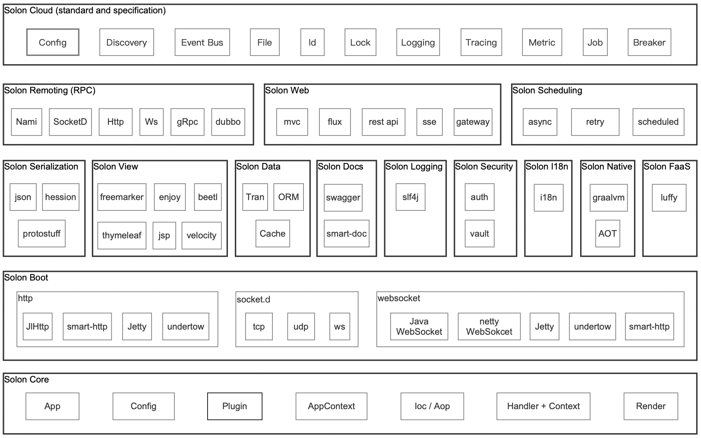
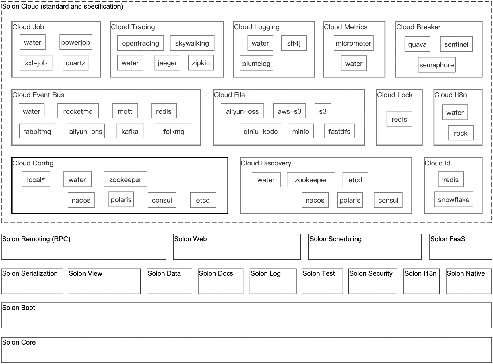

<!--@nrg.languages=en,cn,jp,ru-->
<!--@nrg.defaultLanguage=en-->
<!--@nrg.fileNamePattern.cn=README_CN.md-->
<!--@nrg.fileNamePattern.jp=README_JP.md-->
<!--@nrg.fileNamePattern.ru=README_RU.md-->
<h1 align="center" style="text-align:center;"><!--en-->
<!--en-->
 <!--en-->
Solon<!--en-->
</h1><!--en-->

<!--en-->
	<strong>Java enterprise application development framework for full scenario</strong><!--en-->
     <!--en-->
    <strong>Restrained, Efficient, Open</strong><!--en-->

<!--en-->

<!--en-->
	<a href="https://solon.noear.org/">https://solon.noear.org</a><!--en-->

<!--en-->
<!--en-->

<!--en-->
    <!--en-->
    <a target="_blank" href="https://central.sonatype.com/search?q=org.noear%3Asolon-parent"><!--en-->
        <!--en-->
    </a><!--en-->
    <a target="_blank" href="LICENSE"><!--en-->
		<!--en-->
	</a><!--en-->
    <a target="_blank" href="https://www.oracle.com/java/technologies/javase/javase-jdk8-downloads.html"><!--en-->
		<!--en-->
	</a><!--en-->
    <a target="_blank" href="https://www.oracle.com/java/technologies/javase/jdk11-archive-downloads.html"><!--en-->
		<!--en-->
	</a><!--en-->
    <a target="_blank" href="https://www.oracle.com/java/technologies/javase/jdk17-archive-downloads.html"><!--en-->
		<!--en-->
	</a><!--en-->
    <a target="_blank" href="https://www.oracle.com/java/technologies/javase/jdk21-archive-downloads.html"><!--en-->
		<!--en-->
	</a><!--en-->
    <a target="_blank" href="https://www.oracle.com/java/technologies/downloads/"><!--en-->
		<!--en-->
	</a><!--en-->
     <!--en-->
    <a target="_blank" href='https://gitee.com/opensolon/solon/stargazers'><!--en-->
		<!--en-->
	</a><!--en-->
    <a target="_blank" href='https://github.com/opensolon/solon/stargazers'><!--en-->
		<!--en-->
	</a><!--en-->
    <a target="_blank" href='https://gitcode.com/opensolon/solon/stargazers'><!--en-->
		<!--en-->
	</a><!--en-->

<!--en-->
<!--en-->
<!--en-->
##### Language: English | [中文](README_CN.md) | [Русский](README_RU.md) | [日本語](README_JP.md)<!--en-->
<!--en-->

<!--en-->
<!--en-->

<!--en-->
700% higher concurrency 50% memory savings Startup is 10 times faster. Packing 90% smaller; It also supports java8 ~ java25, native runtime.<!--en-->
 <!--en-->
Built from scratch, with more flexible interface specifications and an open ecosystem<!--en-->

<!--en-->
<!--en-->

<!--en-->
<!--en-->
## Features:<!--en-->
<!--en-->
| Feature                                            | Description                                                                                                                               | <!--en-->
|----------------------------------------------------|-------------------------------------------------------------------------------------------------------------------------------------------| <!--en-->
| Better cost performance for computing resources    | 700% higher concurrency([techempower](https://www.techempower.com/benchmarks/#hw=ph&test=plaintext&section=data-r23)), 50% memory savings |<!--en-->
| Faster development productivity                    | Less code; Easy to get started; 10x faster startup (faster debugging)                                                                     |<!--en-->
| Better production and deployment experience        | Pack 90% smaller                                                                                                                          |<!--en-->
| Greater range of compatibility                     | Non-java-ee architecture; It also supports java8 ~ java25, graalvm native image                                                           |<!--en-->
<!--en-->
<!--en-->
## Main code repository<!--en-->
<!--en-->
<!--en-->
<!--en-->
| Code repository                                                             | Description                                                     | <!--en-->
|-----------------------------------------------------------------------------|-----------------------------------------------------------------| <!--en-->
| [/opensolon/solon](../../../../opensolon/solon)                             | Solon ,Main code repository                                     | <!--en-->
| [/opensolon/solon-examples](../../../../opensolon/solon-examples)           | Solon ,Official website supporting sample code repository       |<!--en-->
|                                                                             |                                                                 |<!--en-->
| [/opensolon/solon-ai](../../../../opensolon/solon-ai)                       | Solon Ai ,Code repository                                       |<!--en-->
| [/opensolon/solon-flow](../../../../opensolon/solon-flow)                   | Solon Flow ,Code repository                                     | <!--en-->
| [/opensolon/solon-expression](../../../../opensolon/solon-expression)       | Solon Expression ,Code repository                               | <!--en-->
| [/opensolon/solon-cloud](../../../../opensolon/solon-cloud)                 | Solon Cloud ,Code repository                                    | <!--en-->
| [/opensolon/solon-admin](../../../../opensolon/solon-admin)                 | Solon Admin ,Code repository                                    | <!--en-->
| [/opensolon/solon-integration](../../../../opensolon/solon-integration)     | Solon Integration ,Code repository                              | <!--en-->
| [/opensolon/solon-java17](../../../../opensolon/solon-java17)               | Solon Java17 ,Code repository（base java17）                      | <!--en-->
| [/opensolon/solon-java25](../../../../opensolon/solon-java25)               | Solon Java25 ,Code repository（base java25）                      | <!--en-->
|                                                                             |                                                                 |<!--en-->
| [/opensolon/soloncode](../../../../opensolon/soloncode)                     | SolonCode(Java8 impl version of "Claude Code") ,Code repository |<!--en-->
| [/opensolon/solonclaw](../../../../opensolon/solonclaw)                     | SolonClaw(Java8 impl version of "OpenClaw") ,Code repository    | <!--en-->
|                                                                             |                                                                 |<!--en-->
| [/opensolon/solon-maven-plugin](../../../../opensolon/solon-gradle-plugin) | Solon Maven ,Plugin code repository                             | <!--en-->
| [/opensolon/solon-gradle-plugin](../../../../opensolon/solon-gradle-plugin) | Solon Gradle ,Plugin code repository                            | <!--en-->
|                                                                             |                                                                 |<!--en-->
| [/opensolon/solon-idea-plugin](../../../../opensolon/solon-idea-plugin)     | Solon Idea ,Plugin code repository                              | <!--en-->
| [/opensolon/solon-vscode-plugin](../../../../opensolon/solon-vscode-plugin) | Solon VsCode ,Plugin code repository                            | <!--en-->
<!--en-->
<!--en-->
<!--en-->
<!--en-->
## Ecosystem Architecture Diagram:<!--en-->
<!--en-->
* solon<!--en-->
<!--en-->
<!--en-->
<!--en-->
* solon cloud<!--en-->
<!--en-->
<!--en-->
<!--en-->
## Official website and related examples, cases：<!--en-->
<!--en-->
* Official website address：[https://solon.noear.org](https://solon.noear.org)<!--en-->
* Official website supporting demos：[https://gitee.com/opensolon/solon-examples](https://gitee.com/opensolon/solon-examples)<!--en-->
* Project unit test：[__test](./__test/)<!--en-->
* User case：[User open source project](https://solon.noear.org/article/555)、[User business project](https://solon.noear.org/article/cases)<!--en-->
<!--en-->
## Special thanks to JetBrains for supporting open-source projects：<!--en-->
<!--en-->
<a href="https://jb.gg/OpenSourceSupport"><!--en-->
  <!--en-->
</a><!--en-->
<!--en-->
<h1 align="center" style="text-align:center;"><!--cn-->
<!--cn-->
 <!--cn-->
Solon<!--cn-->
</h1><!--cn-->

<!--cn-->
	<strong>面向全场景的 Java 企业级应用开发框架</strong><!--cn-->
     <!--cn-->
    <strong>克制、高效、开放</strong><!--cn-->

<!--cn-->

<!--cn-->
	<a href="https://solon.noear.org/">https://solon.noear.org</a><!--cn-->

<!--cn-->
<!--cn-->

<!--cn-->
    <!--cn-->
    <a target="_blank" href="https://central.sonatype.com/search?q=org.noear%3Asolon-parent"><!--cn-->
        <!--cn-->
    </a><!--cn-->
    <a target="_blank" href="LICENSE"><!--cn-->
		<!--cn-->
	</a><!--cn-->
    <a target="_blank" href="https://www.oracle.com/java/technologies/javase/javase-jdk8-downloads.html"><!--cn-->
		<!--cn-->
	</a><!--cn-->
    <a target="_blank" href="https://www.oracle.com/java/technologies/javase/jdk11-archive-downloads.html"><!--cn-->
		<!--cn-->
	</a><!--cn-->
    <a target="_blank" href="https://www.oracle.com/java/technologies/javase/jdk17-archive-downloads.html"><!--cn-->
		<!--cn-->
	</a><!--cn-->
    <a target="_blank" href="https://www.oracle.com/java/technologies/javase/jdk21-archive-downloads.html"><!--cn-->
		<!--cn-->
	</a><!--cn-->
    <a target="_blank" href="https://www.oracle.com/java/technologies/downloads/"><!--cn-->
		<!--cn-->
	</a><!--cn-->
     <!--cn-->
    <a target="_blank" href='https://gitee.com/opensolon/solon/stargazers'><!--cn-->
		<!--cn-->
	</a><!--cn-->
    <a target="_blank" href='https://github.com/opensolon/solon/stargazers'><!--cn-->
		<!--cn-->
	</a><!--cn-->
    <a target="_blank" href='https://gitcode.com/opensolon/solon/stargazers'><!--cn-->
		<!--cn-->
	</a><!--cn-->

<!--cn-->
<!--cn-->
<!--cn-->
##### 语言： 中文 | [English](README_EN.md) | [Русский](README_RU.md) | [日本語](README_JP.md)<!--cn-->
<!--cn-->

<!--cn-->
<!--cn-->

<!--cn-->
并发高 700%；内存省 50%；启动快 10 倍；打包小 90%；同时支持 java8 ~ java25, native 运行时。<!--cn-->
 <!--cn-->
从零开始构建，有更灵活的接口规范与开放生态<!--cn-->

<!--cn-->
<!--cn-->

<!--cn-->
<!--cn-->
## 特性:<!--cn-->
<!--cn-->
| 特性         | 描述                                                                                                             | <!--cn-->
|------------|----------------------------------------------------------------------------------------------------------------| <!--cn-->
| 更高的计算性价比   | 并发高 700%（[techempower](https://www.techempower.com/benchmarks/#hw=ph&test=plaintext&section=data-r23)）；内存省 50% |<!--cn-->
| 更快的开发效率    | 代码少；入门简单；启动快 10倍（调试快）                                                                                          |<!--cn-->
| 更好的生产与部署体验 | 打包小 90%                                                                                                        |<!--cn-->
| 更大的兼容范围    | 非 java-ee 架构；同时支持 java8 ～ java25，graalvm native image                                                          |<!--cn-->
<!--cn-->
<!--cn-->
## 主要代码仓库<!--cn-->
<!--cn-->
<!--cn-->
| 代码仓库                                                                        | 描述                                                              | <!--cn-->
|-----------------------------------------------------------------------------|-----------------------------------------------------------------| <!--cn-->
| [/opensolon/solon](../../../../opensolon/solon)                             | Solon ,主代码仓库                                                    | <!--cn-->
| [/opensolon/solon-examples](../../../../opensolon/solon-examples)           | Solon ,官网配套示例代码仓库                                               |<!--cn-->
|                                                                             |                                                                 |<!--cn-->
| [/opensolon/solon-ai](../../../../opensolon/solon-ai)                       | Solon Ai ,代码仓库                                                  | <!--cn-->
| [/opensolon/solon-flow](../../../../opensolon/solon-flow)                   | Solon Flow ,代码仓库                                                | <!--cn-->
| [/opensolon/solon-expression](../../../../opensolon/solon-expression)       | Solon Expression ,代码仓库                                          | <!--cn-->
| [/opensolon/solon-cloud](../../../../opensolon/solon-cloud)                 | Solon Cloud ,代码仓库                                               | <!--cn-->
| [/opensolon/solon-admin](../../../../opensolon/solon-admin)                 | Solon Admin ,代码仓库                                               | <!--cn-->
| [/opensolon/solon-integration](../../../../opensolon/solon-integration)     | Solon Integration ,代码仓库                                         | <!--cn-->
| [/opensolon/solon-java17](../../../../opensolon/solon-java17)               | Solon Java17 ,代码仓库（base java17）                                 | <!--cn-->
| [/opensolon/solon-java25](../../../../opensolon/solon-java25)               | Solon Java25 ,代码仓库（base java25）                                 | <!--cn-->
|                                                                             |                                                                 |<!--cn-->
| [/opensolon/soloncode](../../../../opensolon/soloncode)                     | SolonCode(Java8 impl version of "Claude Code") ,Code repository |<!--cn-->
| [/opensolon/solonclaw](../../../../opensolon/solonclaw)                     | SolonClaw(Java8 impl version of "OpenClaw") ,Code repository    | <!--cn-->
|                                                                             |                                                                 |<!--cn-->
| [/opensolon/solon-maven-plugin](../../../../opensolon/solon-maven-plugin)  | Solon Maven ,插件代码仓库                                             | <!--cn-->
| [/opensolon/solon-gradle-plugin](../../../../opensolon/solon-gradle-plugin) | Solon Gradle ,插件代码仓库                                            | <!--cn-->
|                                                                             |                                                                 |<!--cn-->
| [/opensolon/solon-idea-plugin](../../../../opensolon/solon-idea-plugin)     | Solon Idea ,插件代码仓库                                              | <!--cn-->
| [/opensolon/solon-vscode-plugin](../../../../opensolon/solon-vscode-plugin) | Solon VsCode ,插件代码仓库                                            | <!--cn-->
<!--cn-->
<!--cn-->
## 生态架构图：<!--cn-->
<!--cn-->
* solon<!--cn-->
<!--cn-->
<!--cn-->
<!--cn-->
* solon cloud<!--cn-->
<!--cn-->
<!--cn-->
<!--cn-->
<!--cn-->
## 官网及相关示例、案例：<!--cn-->
<!--cn-->
* 官网地址：[https://solon.noear.org](https://solon.noear.org)<!--cn-->
* 官网配套演示：[https://gitee.com/opensolon/solon-examples](https://gitee.com/opensolon/solon-examples)<!--cn-->
* 项目单测：[__test](./__test/) <!--cn-->
* 用户案例：[用户开源项目](https://solon.noear.org/article/555)、[用户商业项目](https://solon.noear.org/article/cases)<!--cn-->
<!--cn-->
## 特别感谢JetBrains对开源项目支持：<!--cn-->
<!--cn-->
<a href="https://jb.gg/OpenSourceSupport"><!--cn-->
  <!--cn-->
</a><!--cn-->
<!--cn-->
<h1 align="center" style="text-align:center;"><!--jp-->
<!--jp-->
 <!--jp-->
Solon<!--jp-->
</h1><!--jp-->

<!--jp-->
	<strong>全シーンに向けたJava企業向けアプリケーション開発フレームワーク</strong><!--jp-->
     <!--jp-->
    <strong>抑制、効率、オープン</strong><!--jp-->

<!--jp-->

<!--jp-->
	<a href="https://solon.noear.org/">https://solon.noear.org</a><!--jp-->

<!--jp-->
<!--jp-->

<!--jp-->
    <!--jp-->
    <a target="_blank" href="https://central.sonatype.com/search?q=org.noear%3Asolon-parent"><!--jp-->
        <!--jp-->
    </a><!--jp-->
    <a target="_blank" href="LICENSE"><!--jp-->
		<!--jp-->
	</a><!--jp-->
    <a target="_blank" href="https://www.oracle.com/java/technologies/javase/javase-jdk8-downloads.html"><!--jp-->
		<!--jp-->
	</a><!--jp-->
    <a target="_blank" href="https://www.oracle.com/java/technologies/javase/jdk11-archive-downloads.html"><!--jp-->
		<!--jp-->
	</a><!--jp-->
    <a target="_blank" href="https://www.oracle.com/java/technologies/javase/jdk17-archive-downloads.html"><!--jp-->
		<!--jp-->
	</a><!--jp-->
    <a target="_blank" href="https://www.oracle.com/java/technologies/javase/jdk21-archive-downloads.html"><!--jp-->
		<!--jp-->
	</a><!--jp-->
    <a target="_blank" href="https://www.oracle.com/java/technologies/downloads/"><!--jp-->
		<!--jp-->
	</a><!--jp-->
     <!--jp-->
    <a target="_blank" href='https://gitee.com/opensolon/solon/stargazers'><!--jp-->
		<!--jp-->
	</a><!--jp-->
    <a target="_blank" href='https://github.com/opensolon/solon/stargazers'><!--jp-->
		<!--jp-->
	</a><!--jp-->
    <a target="_blank" href='https://gitcode.com/opensolon/solon/stargazers'><!--jp-->
		<!--jp-->
	</a><!--jp-->

<!--jp-->
<!--jp-->
<!--jp-->
##### 言語： 日本語 | [中文](README_CN.md) | [English](README_EN.md) | [Русский](README_RU.md)<!--jp-->
<!--jp-->

<!--jp-->

<!--jp-->
高い700%を併発します;メモリ省50%です;10倍速く起動します梱包は90%小さいです;java8 ~ java25、ネイティブランに対応しています。<!--jp-->
 <!--jp-->
より柔軟なインタフェース仕様とオープンエコシステムをゼロベースで構築しました<!--jp-->

<!--jp-->

<!--jp-->
<!--jp-->
## 特性です:<!--jp-->
<!--jp-->
<!--jp-->
| 特性です                         | 記述します                                                                                                                | <!--jp-->
|------------------------------|----------------------------------------------------------------------------------------------------------------------| <!--jp-->
| コンピュータ資源のコストパフォーマンスが向上しました   | 高い700%を併発します([techempower](https://www.techempower.com/benchmarks/#hw=ph&test=plaintext&section=data-r23));メモリ省50%です |<!--jp-->
| 開発の効率が上がります                  | コードが少ないです;入門は簡単です;起働が10倍速いです(段取が速いです)                                                                                |<!--jp-->
| より良い生産と配備の経験を得ることができます       | 梱包が90%小さくなりました                                                                                                       |<!--jp-->
| より広い互換性を持っています               | 非java-eeアーキテクチャです;java8 ~ java25、graalvmネイティブイメージもサポートしています。                                                         |<!--jp-->
<!--jp-->
## 主要なコードリポジトリです<!--jp-->
<!--jp-->
<!--jp-->
| コードリポジトリです                                                                  | 記述します                                                           | <!--jp-->
|-----------------------------------------------------------------------------|-----------------------------------------------------------------| <!--jp-->
| [/opensolon/solon](../../../../opensolon/solon)                             | Solon ,メインコードのリポジトリです                                           | <!--jp-->
| [/opensolon/solon-examples](../../../../opensolon/solon-examples)           | Solon ,公式サイトの例コードリポジトリです                                        |<!--jp-->
|                                                                             |                                                                 |<!--jp-->
| [/opensolon/solon-ai](../../../../opensolon/solon-ai)                       | Solon Ai ,コードリポジトリです                                            | <!--jp-->
| [/opensolon/solon-flow](../../../../opensolon/solon-flow)                   | Solon Flow ,コードリポジトリです                                          | <!--jp-->
| [/opensolon/solon-expression](../../../../opensolon/solon-expression)       | Solon Expression ,コードリポジトリです                                    | <!--jp-->
| [/opensolon/solon-cloud](../../../../opensolon/solon-cloud)                 | Solon Cloud ,コードリポジトリです                                         | <!--jp-->
| [/opensolon/solon-admin](../../../../opensolon/solon-admin)                 | Solon Admin ,コードリポジトリです                                         | <!--jp-->
| [/opensolon/solon-integration](../../../../opensolon/solon-integration)     | Solon Integration ,コードリポジトリです                                   | <!--jp-->
| [/opensolon/solon-java17](../../../../opensolon/solon-java17)               | Solon Java17 ,コードリポジトリです（base java17）                           | <!--jp-->
| [/opensolon/solon-java25](../../../../opensolon/solon-java25)               | Solon Java25 ,コードリポジトリです（base java25）                           | <!--jp-->
|                                                                             |                                                                 |<!--jp-->
| [/opensolon/soloncode](../../../../opensolon/soloncode)                     | SolonCode(Java8 impl version of "Claude Code") ,Code repository |<!--jp-->
| [/opensolon/solonclaw](../../../../opensolon/solonclaw)                     | SolonClaw(Java8 impl version of "OpenClaw") ,Code repository    | <!--jp-->
|                                                                             |                                                                 |<!--jp-->
| [/opensolon/solon-maven-plugin](../../../../opensolon/solon-gradle-plugin) | Solon Maven ,プラグインのリポジトリです                                      | <!--jp-->
| [/opensolon/solon-gradle-plugin](../../../../opensolon/solon-gradle-plugin) | Solon Gradle ,プラグインのリポジトリです                                     | <!--jp-->
|                                                                             |                                                                 |<!--jp-->
| [/opensolon/solon-idea-plugin](../../../../opensolon/solon-idea-plugin)     | Solon Idea ,プラグインのリポジトリです                                       | <!--jp-->
| [/opensolon/solon-vscode-plugin](../../../../opensolon/solon-vscode-plugin) | Solon VsCode ,プラグインのリポジトリです                                     | <!--jp-->
<!--jp-->
<!--jp-->
## エコシステム：<!--jp-->
<!--jp-->
* solon<!--jp-->
<!--jp-->
<!--jp-->
<!--jp-->
* solon cloud<!--jp-->
<!--jp-->
<!--jp-->
<!--jp-->
## 公式サイトと関するデモ・ケース：<!--jp-->
<!--jp-->
* 公式サイト：[https://solon.noear.org](https://solon.noear.org)<!--jp-->
* 公式サイトのデモ：[https://gitee.com/opensolon/solon-examples](https://gitee.com/opensolon/solon-examples)<!--jp-->
* プロジェクトのシングルテスト：[__test](./__test/) <!--jp-->
* ユーザーケース：[オープンソースプロジェクトです](https://solon.noear.org/article/555)、[ユーザービジネスです](https://solon.noear.org/article/cases)<!--jp-->
<!--jp-->
<!--jp-->
## オープンソースプロジェクトへのサポートしてくれたJetBrainsに特別感謝致します<!--jp-->
<!--jp-->
<a href="https://jb.gg/OpenSourceSupport"><!--jp-->
  <!--jp-->
</a><!--jp-->
<!--jp-->
<h1 align="center" style="text-align:center;"><!--ru-->
<!--ru-->
 <!--ru-->
Solon<!--ru-->
</h1><!--ru-->

<!--ru-->
	<strong>Структура разработки приложений на бизнес-уровне, ориентированная на полную сцену</strong><!--ru-->
     <!--ru-->
    <strong>сдержанность, эффективность, открытость</strong><!--ru-->

<!--ru-->

<!--ru-->
	<a href="https://solon.noear.org/">https://solon.noear.org</a><!--ru-->

<!--ru-->
<!--ru-->

<!--ru-->
    <!--ru-->
    <a target="_blank" href="https://central.sonatype.com/search?q=org.noear%3Asolon-parent"><!--ru-->
        <!--ru-->
    </a><!--ru-->
    <a target="_blank" href="LICENSE"><!--ru-->
		<!--ru-->
	</a><!--ru-->
    <a target="_blank" href="https://www.oracle.com/java/technologies/javase/javase-jdk8-downloads.html"><!--ru-->
		<!--ru-->
	</a><!--ru-->
    <a target="_blank" href="https://www.oracle.com/java/technologies/javase/jdk11-archive-downloads.html"><!--ru-->
		<!--ru-->
	</a><!--ru-->
    <a target="_blank" href="https://www.oracle.com/java/technologies/javase/jdk17-archive-downloads.html"><!--ru-->
		<!--ru-->
	</a><!--ru-->
    <a target="_blank" href="https://www.oracle.com/java/technologies/javase/jdk21-archive-downloads.html"><!--ru-->
		<!--ru-->
	</a><!--ru-->
    <a target="_blank" href="https://www.oracle.com/java/technologies/downloads/"><!--ru-->
		<!--ru-->
	</a><!--ru-->
     <!--ru-->
    <a target="_blank" href='https://gitee.com/opensolon/solon/stargazers'><!--ru-->
		<!--ru-->
	</a><!--ru-->
    <a target="_blank" href='https://github.com/opensolon/solon/stargazers'><!--ru-->
		<!--ru-->
	</a><!--ru-->
    <a target="_blank" href='https://gitcode.com/opensolon/solon/stargazers'><!--ru-->
		<!--ru-->
	</a><!--ru-->

<!--ru-->
<!--ru-->
<!--ru-->
##### язык： Русский | [中文](README_CN.md)  | [English](README_EN.md) | [日本語](README_JP.md)<!--ru-->
<!--ru-->

<!--ru-->
<!--ru-->

<!--ru-->
На 700% выше; 50% памяти; Запуск в 10 раз быстрее; Упакуйте на 90% меньше; Поддерживает java8 - java25 в то же время, когда нейтив работает.<!--ru-->
 <!--ru-->
Построенный с нуля, с более гибкими нормами интерфейса и открытой экологией<!--ru-->

<!--ru-->

<!--ru-->
<!--ru-->
## функц:<!--ru-->
<!--ru-->
<!--ru-->
| функц                                                      | описыва                                                                                                                 | <!--ru-->
|------------------------------------------------------------|-------------------------------------------------------------------------------------------------------------------------| <!--ru-->
| Более высокое соотношение вычислительных ресурсов к цене   | На 700% выше([techempower](https://www.techempower.com/benchmarks/#hw=ph&test=plaintext&section=data-r23)); 50% памяти. |<!--ru-->
| Более быстрое развитие                                     | Мало кодов; Начало простое. Запуск в 10 раз быстрее.                                                                    |<!--ru-->
| Лучший опыт производства и развертывания                   | На 90% меньше.                                                                                                          |<!--ru-->
| Более широкий диапазон совместимости                       | Архитектура не java-ee; Поддерживает java8 - java25, graalvm native image                                               |<!--ru-->
<!--ru-->
<!--ru-->
## Основной кодовый склад<!--ru-->
<!--ru-->
<!--ru-->
| Кодовый склад                                                               | описыва                                                         | <!--ru-->
|-----------------------------------------------------------------------------|-----------------------------------------------------------------| <!--ru-->
| [/opensolon/solon](../../../../opensolon/solon)                             | Solon ,Главный код пакгауза                                     | <!--ru-->
| [/opensolon/solon-examples](../../../../opensolon/solon-examples)           | Solon ,Стандартный набор кодов на официальном сайте             |<!--ru-->
|                                                                             |                                                                 |<!--ru-->
| [/opensolon/solon-ai](../../../../opensolon/solon-ai)                       | Solon Ai ,Кодовый склад                                         | <!--ru-->
| [/opensolon/solon-flow](../../../../opensolon/solon-flow)                   | Solon Flow ,Кодовый склад                                       | <!--ru-->
| [/opensolon/solon-expression](../../../../opensolon/solon-expression)       | Solon Expression ,Кодовый склад                                 | <!--ru-->
| [/opensolon/solon-cloud](../../../../opensolon/solon-cloud)                 | Solon Cloud ,Кодовый склад                                      | <!--ru-->
| [/opensolon/solon-admin](../../../../opensolon/solon-admin)                 | Solon Admin ,Кодовый склад                                      | <!--ru-->
| [/opensolon/solon-integration](../../../../opensolon/solon-integration)     | Solon Integration ,Кодовый склад                                | <!--ru-->
| [/opensolon/solon-java17](../../../../opensolon/solon-java17)               | Solon Java17 ,Кодовый склад（base java17）                        | <!--ru-->
| [/opensolon/solon-java25](../../../../opensolon/solon-java25)               | Solon Java25 ,Кодовый склад（base java25）                        | <!--ru-->
|                                                                             |                                                                 |<!--ru-->
| [/opensolon/soloncode](../../../../opensolon/soloncode)                     | SolonCode(Java8 impl version of "Claude Code") ,Code repository |<!--ru-->
| [/opensolon/solonclaw](../../../../opensolon/solonclaw)                     | SolonClaw(Java8 impl version of "OpenClaw") ,Code repository    | <!--ru-->
|                                                                             |                                                                 |<!--ru-->
| [/opensolon/solon-maven-plugin](../../../../opensolon/solon-gradle-plugin) | Solon Maven ,Код плагина хранилища                              | <!--ru-->
| [/opensolon/solon-gradle-plugin](../../../../opensolon/solon-gradle-plugin) | Solon Gradle ,Код плагина хранилища                             | <!--ru-->
|                                                                             |                                                                 |<!--ru-->
| [/opensolon/solon-idea-plugin](../../../../opensolon/solon-idea-plugin)     | Solon Idea ,Код плагина хранилища                               | <!--ru-->
| [/opensolon/solon-vscode-plugin](../../../../opensolon/solon-vscode-plugin) | Solon VsCode ,Код плагина хранилища                             | <!--ru-->
<!--ru-->
<!--ru-->
## Экологическая архитектура：<!--ru-->
<!--ru-->
* solon<!--ru-->
<!--ru-->
<!--ru-->
<!--ru-->
* solon cloud<!--ru-->
<!--ru-->
<!--ru-->
<!--ru-->
## Официальная сеть и связанные с ней примеры, дела：<!--ru-->
<!--ru-->
* Адрес основной сети：[https://solon.noear.org](https://solon.noear.org)<!--ru-->
* Демо в комплекте с официальной сетью：[https://gitee.com/opensolon/solon-examples](https://gitee.com/opensolon/solon-examples)<!--ru-->
* Монометрия проекта：[__test](./__test/) <!--ru-->
* Дело пользователя：[Пользовательский проект с открытым исходным кодом](https://solon.noear.org/article/555)、[Коммерческий проект пользователя](https://solon.noear.org/article/cases)<!--ru-->
<!--ru-->
<!--ru-->
## Особая благодарность JetBrains за поддержку проекта open source：<!--ru-->
<!--ru-->
<a href="https://jb.gg/OpenSourceSupport"><!--ru-->
  <!--ru-->
</a><!--ru-->
<!--ru-->
