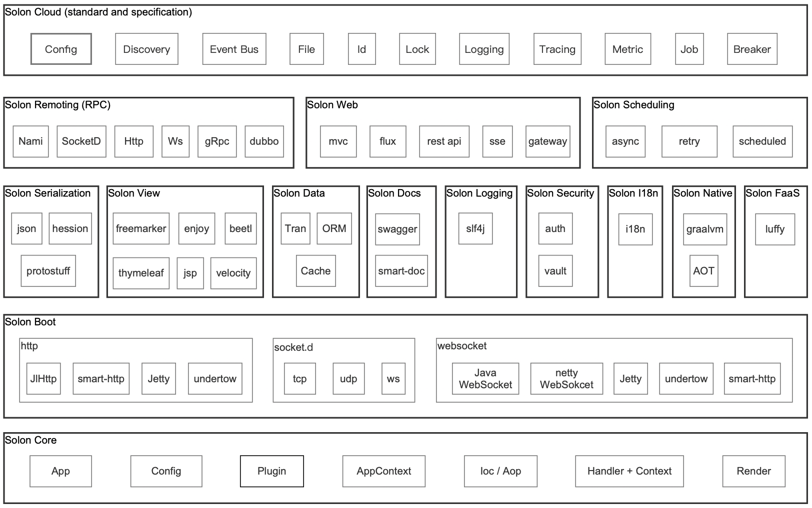

<h1 align="center" style="text-align:center;">

<br />
Solon v2.3.7
</h1>
<p align="center">
	<strong>Javaの新しい生態系アプリケーション開発フレームワーク、より小さく、より速く、より簡単に！</strong>
</p>
<p align="center">
	<a href="https://solon.noear.org/">https://solon.noear.org</a>
</p>

<p align="center">
    <a target="_blank" href="https://central.sonatype.com/search?q=org.noear%2520solon-parent">
        
    </a>
    <a target="_blank" href="https://www.apache.org/licenses/LICENSE-2.0.txt">
		
	</a>
    <a target="_blank" href="https://www.oracle.com/java/technologies/javase/javase-jdk8-downloads.html">
		
	</a>
    <a target="_blank" href="https://www.oracle.com/java/technologies/javase/jdk11-archive-downloads.html">
		
	</a>
    <a target="_blank" href="https://www.oracle.com/java/technologies/javase/jdk17-archive-downloads.html">
		
	</a>
    <a target="_blank" href="https://www.oracle.com/java/technologies/javase/jdk20-archive-downloads.html">
		
	</a>
    <br />
    <a target="_blank" href='https://gitee.com/noear/solon/stargazers'>
		
	</a>
    <a target="_blank" href='https://github.com/noear/solon/stargazers'>
		
	</a>
</p>

<br/>
<p align="center">
	<a href="https://jq.qq.com/?_wv=1027&k=kjB5JNiC">
	</a>
</p>

##### 言語： 日本語 | [中文](README.md) | [English](README_EN.md) | [Русский](README_RU.md)

<hr />

起動が5～10倍速く、qpsは2～3倍高く、ランタイムメモリの使用量1/3〜1/2少なく、パッケージは1/2～1/10小さくなります。

<hr />

## 紹介：

ゼロから構築されます。独自の標準規範と開放的なエコシステムを備えており、異なるエコプラグインを組み合わせて、様々なニーズに対応し、迅速にカスタマイズや開発が可能です。

* **理性的・簡易的・効率的・開放的・エコシステム的**
* JDK8、JDK11、JDK17、JDK20に対応可能
* Http、WebSocket、Socket の3つの信号を統合した開発体験 (通称: 3ソース統合)
* 「注釈」と「手動」の2種類のモードをサポートし、必要に応じて自由に操作可能
* Not Servlet、あらゆる通信インフラストラクチャに適合（最小0.3 mでrpcアーキテクチャが実行可能）
* ユニークなIOC/AOP容器のデザインです。プラグインが多くなったからといって起動が遅くなることはありません
* Web、Data、Job、Remoting、Cloudなどの開発シナリオをサポート
* Handler+ContextとListener+Messageの2つのイベントモデルを両立
* プラグイン式の拡張を強調し、異なるアプリケーションシーンに対応可能
* GraalVm Nativeパッケージをサポート
* サービスプラグイン「ホットプラグ」「ホットプラグ」「ホットマネジメント」を許可します。


## エコシステム：



## こんにちは世界：

```xml
<parent>
    <groupId>org.noear</groupId>
    <artifactId>solon-parent</artifactId>
    <version>2.3.7</version>   
</parent>

<dependencies>
    <dependency>
        <groupId>org.noear</groupId>
        <artifactId>solon-web</artifactId>
    </dependency>
</dependencies>
```

```java
@SolonMain
public class App{
    public static void main(String[] args){
        Solon.start(App.class, args, app->{
            //Handler mode：
            app.get("/hello",(c)->c.output("Hello world!"));
        });
    }
}

//Controller mode：(mvc or rest-api)
@Controller
public class HelloController{
    //Socketメソッドタイプの修飾
    @Socket
    @Mapping("/mvc/hello")
    public String hello(String name){
        return "Hello " + name;
    }
}

//Remoting mode：(rpc)
@Mapping("/rpc/")
@Remoting
public class HelloServiceImpl implements HelloService{
    @Override
    public String hello(){
        return "Hello world!";
    }
}
```


## メインフレームワークおよび高速統合開発パッケージ：

###### メインフレーム：

| コンポーネントパッケージ                    | 説明                          |
|------------------------|-----------------------------|
| org.noear:solon-parent | 依存バージョン管理                      |
| org.noear:solon        | メインフレーム                         |
| org.noear:nami         | 随伴フレームワーク（solon remotingのクライアントとして） |

###### 開発パッケージと相互関係の迅速な統合：

| コンポーネントパッケージ                       | 説明                                                          |
|---------------------------|-------------------------------------------------------------|
| org.noear:solon-lib       | 基盤統合パッケージの迅速な開発                                             |
| org.noear:solon-api       | solon-lib + jlhttp boot；高速開発インタフェースアプリケーション                 |
| org.noear:solon-web       | solon-api + freemarker + sessionstate；高速開発WEBアプリケーション       |
| org.noear:solon-beetl-web | solon-api + beetl + beetlsql + sessionstate；高速開発WEBアプリケーション |
| org.noear:solon-enjoy-web | solon-api + enjoy + arp + sessionstate；高速開発WEBアプリケーション      |
| org.noear:solon-rpc       | solon-api + nami；高速開発RPCアプリケーション                            |
| org.noear:solon-cloud     | solon-rpc + consul；マイクロサービスアプリケーションの迅速な開発                                |


## 公式サイトおよび関連例：

* 公式サイト：[https://solon.noear.org](https://solon.noear.org)
* 公式サイトのデモ：[https://gitee.com/noear/solon-examples](https://gitee.com/noear/solon-examples)
* プロジェクトのシングルテスト：[__test](./__test/) 
* プロジェクトの詳細機能の例：[solon_api_demo](https://gitee.com/noear/solon_api_demo)  、 [solon_rpc_demo](https://gitee.com/noear/solon_rpc_demo) 、 [solon_socketd_demo](https://gitee.com/noear/solon_socketd_demo) 、 [solon_cloud_demo](https://gitee.com/noear/solon_cloud_demo) 、 [solon_auth_demo](https://gitee.com/noear/solon_auth_demo)

## 特にJetBrainsのオープンソースプロジェクトへのサポートに感謝します

<a href="https://jb.gg/OpenSourceSupport">
  
</a>

