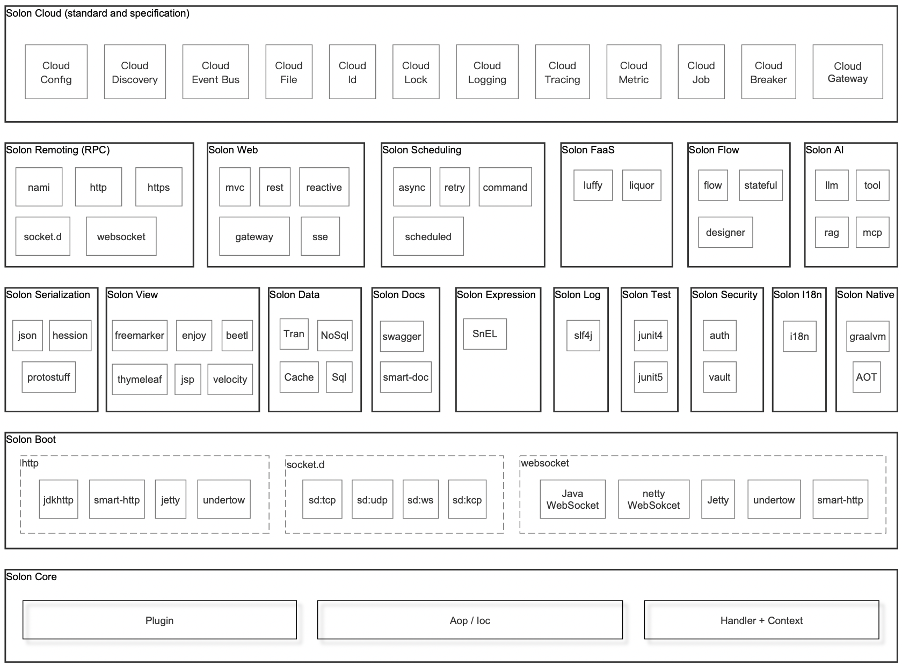

<h1 align="center" style="text-align:center;">

 
Solon v2.8.1-M3
</h1>

	<strong>Javaの新しいアプリケーション開発フレームワーク、より速く、より小さく、より簡単です!</strong>
     
    <strong>【オープン・アトム・オープンソース財団インキュベーション・プログラムです】</strong>

	<a href="https://solon.noear.org/">https://solon.noear.org</a>

    
    
    
    
    
    
    
     
    
    

 

	

##### 言語： 日本語 | [中文](README_CN.md) | [English](README_EN.md) | [Русский](README_RU.md)

2 ~ 3倍の高さですメモリ省50%です;5 ~ 10倍速く働きます;パッケージは小さい50% ~ 90%です;java8 ~ java22に対応しています
 
より柔軟なインタフェース仕様とオープンエコシステムをゼロベースで構築しました

## 特徴です:

計算費用対効果が高くなります

* スループット:1秒間に2 ~ 3倍の量を併発します
* リソース:メモリ50%節約します

より効率的で簡単なコーディング体験ができます

* 開発:柔軟で簡潔なアーキテクチャです;入りが早いです
* 調整します:再開します速い5 ~ 10倍;特定の問題の方が早いです

より速い生産と配備の経験ができます

* 作業:パッケージを50% ~ 90%縮小します。
* 部署:ミラーリングが速く、起働が速いです(5 ~ 10倍)

ランタイム互換範囲が広がります

* ブレークスルー:非java-eeアーキテクチャ、より柔軟性があります
* 互換性:同時互換性java8、java11、java17、java21、java22ランタイム

## エコシステム：

* solon

* solon cloud

## 公式サイトと関するデモ・ケース：

* 公式サイト：[https://solon.noear.org](https://solon.noear.org)
* 公式サイトのデモ：[https://gitee.com/noear/solon-examples](https://gitee.com/noear/solon-examples)
* プロジェクトのシングルテスト：[__test](./__test/) 
* ユーザーケース：[オープンソースプロジェクトです](https://solon.noear.org/article/555)、[ユーザービジネスです](https://solon.noear.org/article/cases)

## オープンソースプロジェクトへのサポートしてくれたJetBrainsに特別感謝致します

