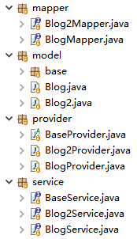
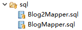

# activerecord-solon-plugin


#### 介绍


此说明文档中的示例及源码来自于专有Demo：https://gitee.com/gollyhu/activerecord-solon-plugin-demo


#### 使用说明

1. 配置示例

   ```yaml
   demo.db1:
     schema: rock
     jdbcUrl: jdbc:mysql://localhost:3306/jfinal_demo?useSSL=false
     driverClassName: com.mysql.jdbc.Driver
     username: root
     password: 123456
   
   demo.db2:
     schema: rock
     jdbcUrl: jdbc:mysql://localhost:3306/jfinal_demo?useSSL=false
     driverClassName: com.mysql.jdbc.Driver
     username: root
     password: 123456
   ```

   

2. 启动示例

   ``` java
   /**
    * 启动应用
    */
   public class DemoApp {
       public static void main(String[] args) {
           Solon.start(DemoApp.class, args, app -> {
               app.onEvent(ActiveRecordPlugin.class, arp -> {
                   if (Solon.cfg().isDebugMode() || Solon.cfg().isFilesMode()) {
                       arp.setDevMode(true); // 启用开发模式
                       arp.setShowSql(true); // 启用SQL输出
                   }
               });
           });
       }
   }
   ```

   

3. 数据源配置示例

   ``` java
   /**
    * 配置数据源
    */
   @Configuration
   public class Config {
   
       @Bean(name="db1", typed=true) // typed=true 为默认数据源
       public DataSource db1(@Inject("${demo.db1}") HikariDataSource dataSource) {
           return dataSource;
       }
   
       @Bean("db2") // 指定ActiveRecord数据源名称为db2
       public DataSource db2(@Inject("${demo.db2}") HikariDataSource dataSource) {
           return dataSource;
       }
   
   }
   ```

   

4. 应用示例

   ```java
   @Controller
   @Mapping("/blog")
   public class BlogController {
       
       @Inject
       BlogService blogService;
   
       @Mapping("/add")
       public ModelAndView add(Context ctx) {
           return new ModelAndView("/blog/add.html");
       }
   
       @Mapping("/delete/{id}")
       public void delete(Context ctx, Integer id) {
           this.blogService.deleteById(id);
           ctx.redirect("/blog");
       }
   
       @Mapping("/edit/{id}")
       public ModelAndView edit(Context ctx, Integer id) {
           ModelAndView mav = new ModelAndView("/blog/edit.html");
           mav.put("blog", this.blogService.findById(id));
           return mav;
       }
   
       @Mapping
       public ModelAndView index(Context ctx) {
           return this.index(ctx, 1);
       }
   
       @Mapping("/{pageNumber}")
       public ModelAndView index(Context ctx, Integer pageNumber) {
           ModelAndView mav= new ModelAndView("/blog/blog.html");
           mav.put("blogPage", this.blogService.paginate(pageNumber, 10));
           return mav;
       }
   
       /**
        * save 与 update 的业务逻辑在实际应用中也应该放在 serivce 之中，
        * 并要对数据进正确性进行验证，在此仅为了偷懒
        */
       @NotEmpty({"title", "content"})
       @Mapping("/save")
       public void save(Context ctx, @Validated Blog blog) {
           this.blogService.save(blog);
           ctx.redirect("/blog");
       }
   
       /**
        * save 与 update 的业务逻辑在实际应用中也应该放在 serivce 之中，
        * 并要对数据进正确性进行验证，在此仅为了偷懒
        */
       @NotEmpty({"id", "title", "content"})
       @Mapping("/update")
       public void update(Context ctx, @Validated Blog blog) {
           this.blogService.update(blog);
           ctx.redirect("/blog");
       }
   }
   ```
   
   

#### 代码生成

1. 代码生成器

```java
/**
 * 代码生成器
 */
public class _Generator {
    public static void main(String[] args) {
        // 获取数据源
        DataSource ds1 = getDataSource1();
        DataSource ds2 = getDataSource2();

        System.out.println("Start generate...\n");

        // 默认数据源
        SolonGenerator generator = new SolonGenerator(ds1, "cn.hg.solon.plugin.activerecord.demo.common");
        // 排除表
        generator.addBlacklist("blog2");
        // 指定自定义Model基类
        generator.setBaseModelClassName(BaseModel.class.getName());
        // 生成
        generator.generate();

        // ds2数据源
        SolonGenerator generator2 = new SolonGenerator(ds2, "cn.hg.solon.plugin.activerecord.demo.common");
        // 排除表
        generator2.addBlacklist("blog");
        // 非默认数据一定要指定数据源Bean名称
        generator2.setDataSourceBeanName("db2");
        // 指定自定义Model基类
        generator2.setBaseModelClassName(BaseModel.class.getName());
        // 生成
        generator2.generate();

        System.out.println("\nFinished generate.");
    }
    
    private static DataSource getDataSource1() {
        HikariCpPlugin plugin = new HikariCpPlugin("jdbc:mysql://localhost/jfinal_demo?useSSL=false", "root", "123456");
        plugin.start();
        return plugin.getDataSource();
    }

    private static DataSource getDataSource2() {
        HikariCpPlugin plugin = new HikariCpPlugin("jdbc:mysql://localhost/jfinal_demo?useSSL=false", "root", "123456");
        plugin.start();
        return plugin.getDataSource();
    }
}
```


2. 代码结构

   

   

   

3. 代码示例

  - Mapper

    ```java
    @Namespace("BlogMapper")
    public interface BlogMapper {
    	......
    
        // isUpdate = true 表示接口为非查询接口
        @Sql(value = "{DELETE FROM `blog` WHERE `id` = #para(id)}", isUpdate = true)
        long deleteById(Object id);
        
    	......
    
        @Sql("{ SELECT * FROM `blog` }")
        List<Blog> findAll();
    
        @Sql("findByModel")
        List<Blog> findBy(Blog model);
    
        @Sql("findByMap")
        List<Blog> findBy(Map<String, ?> map);
    
        @Sql("findByModel")
        List<Blog> findBy(Blog model, String orderColumn, String orderDirection);
    
        @Sql("findByMap")
        List<Blog> findBy(Map<String, ?> map, String orderColumn, String orderDirection);
        
        ......
    }
    
    @Namespace("Blog2Mapper")
    public interface Blog2Mapper {
    	......
    
        // isUpdate = true 表示接口为非查询接口
        @Sql(value = "{DELETE FROM `blog2` WHERE `id` = #para(id)}", isUpdate = true)
        long deleteById(Object id);
        
    	......
    
        @Sql("{ SELECT * FROM `blog2` }")
        List<Blog2> findAll();
    
        @Sql("findByModel")
        List<Blog2> findBy(Blog2 model);
    
        @Sql("findByMap")
        List<Blog2> findBy(Map<String, ?> map);
    
        @Sql("findByModel")
        List<Blog2> findBy(Blog2 model, String orderColumn, String orderDirection);
    
        @Sql("findByMap")
        List<Blog2> findBy(Map<String, ?> map, String orderColumn, String orderDirection);
    
        ......
    }
    ```

    

  - BaseModel

    ```java
    public abstract class BaseBlog<M extends BaseBlog<M>> extends Model<M> implements IBean {
        ......
    }
    
    public abstract class BaseBlog2<M extends BaseBlog2<M>> extends Model<M> implements IBean {
        ......
    }
    ```

    

  - Model

    ```java
    @Db(DbKit.MAIN_CONFIG_NAME)
    @Table(name = "blog", primaryKey = "id")
    public class Blog extends BaseBlog<Blog> {
    	public static final Blog DAO = new Blog().dao();
    }
    
    @Db("db2") // 生成此对象时指定了数据源名称为"db2"
    @Table(name = "blog2", primaryKey = "id")
    public class Blog2 extends BaseBlog2<Blog2> {
    	public static final Blog2 DAO = new Blog2().dao();
    }
    ```

    

  - SQL

    ```sql
    BlogMapper.sql 文件
    #namespace("BlogMapper")
    
    #sql("countBy") ### 统计满足条件的记录数
        SELECT COUNT(*) FROM `blog` #@whereFor()
    #end
    
    #sql("deleteBy") ### 删除满足条件的记录
        DELETE FROM `blog` #@whereFor()
    #end
    
        ......
    
    #sql("paginateBy") ### 查找满足条件的分页记录, 并按指定条件排序
        SELECT * FROM `blog` #@whereFor()
        #if(orderColumn)ORDER BY #(orderColumn)#if(orderDirection) #(orderDirection)#end#end
    #end
    
    	.......
    
    ### ********************
    ### WHERE 条件，可在此处修改查询条件，如:`name` LIKE #para(name, "like")
    ### ********************
    #define whereFor()
    WHERE TRUE
        #if(id)AND `id` = #para(id)#end
        #if(title)AND `title` = #para(title)#end
        #if(content)AND `content` = #para(content)#end
    #end
    
    #end
    
    
    
    Blog2Mapper.sql 文件
    #namespace("Blog2Mapper")
    
    #sql("countBy") ### 统计满足条件的记录数
        SELECT COUNT(*) FROM `blog2` #@whereFor()
    #end
    
    #sql("deleteBy") ### 删除满足条件的记录
        DELETE FROM `blog2` #@whereFor()
    #end
    
        ......
    
    #sql("paginateBy") ### 查找满足条件的分页记录, 并按指定条件排序
        SELECT * FROM `blog2` #@whereFor()
        #if(orderColumn)ORDER BY #(orderColumn)#if(orderDirection) #(orderDirection)#end#end
    #end
    
        ......
        
    ### ********************
    ### WHERE 条件，可在此处修改查询条件，如:`name` LIKE #para(name, "like")
    ### ********************
    #define whereFor()
    WHERE TRUE
        #if(id)AND `id` = #para(id)#end
        #if(title)AND `title` = #para(title)#end
        #if(content)AND `content` = #para(content)#end
    #end
    
    #end
    ```

    

  - Service

    ```java
    public interface BlogService extends BaseService<Blog> {
    
    }
    
    public interface Blog2Service extends BaseService<Blog2> {
    
    }
    
    public interface BaseService<M extends BaseModel<M>> {
        long count();
        long countBy(M model);
        long countBy(Map<?, ?> map);
        long deleteBy(M model);
        long deleteBy(Map<?, ?> map);
        boolean deleteById(Object id);
        boolean deleteByIds(Object... ids);
        List<M> findAll();
        List<M> findBy(M model);
        List<M> findBy(Map<?, ?> map);
        List<M> findBy(M model, String orderColumn, String orderDirection);
        List<M> findBy(Map<?, ?> map, String orderColumn, String orderDirection);
        M findById(Object id);
        M findFirstBy(M model);
        M findFirstBy(Map<?, ?> map);
        M findFirstBy(M model, String orderColumn, String orderDirection);
        M findFirstBy(Map<?, ?> map, String orderColumn, String orderDirection);
        Page<M> paginate(int pageNumber, int pageSize);
        Page<M> paginateBy(int pageNumber, int pageSize, M model);
        Page<M> paginateBy(int pageNumber, int pageSize, Map<?, ?> map);
        Page<M> paginateBy(int pageNumber, int pageSize, M model, String orderColumn, String orderDirection);
        Page<M> paginateBy(int pageNumber, int pageSize, Map<?, ?> map, String orderColumn, String orderDirection);
        boolean save(M model);
        long saveMore(List<M> list);
        boolean update(M model);
        long updateMore(List<M> list);
    }
    ```

    

  - Provider

    ``` java
    @ProxyComponent
    public class BlogProvider extends BaseProvider<Blog> implements BlogService {
    
        public BlogProvider() {
            super(DbKit.MAIN_CONFIG_NAME, "BlogMapper");
        }
    
    }
    
    @ProxyComponent
    public class Blog2Provider extends BaseProvider<Blog2> implements Blog2Service {
    
        public Blog2Provider() {
            super("db2", "Blog2Mapper");
        }
    
    }
    
    public abstract class BaseProvider<M extends BaseModel<M>> {
        // 代码太多，请参看源码
    }
    ```

    

  #### 应用示例

  1. Service用法（推荐）

  ```java
  @Controller
  @Mapping("/blog")
  public class BlogController {
  
      @Inject
      BlogService blogService;
      
      @Mapping("/findAll")
      public List<Blog> findAll(Context ctx){
          return this.blogService.findAll();
      }
  
      @Mapping("/findBy")
      public List<Blog> findBy(Context ctx){
          return this.blogService.findBy(ctx.paramMap(), "id", "desc");
      }
  
      @Mapping("/findBy")
      public List<Blog> findBy(Context ctx, Blog model){
          return this.blogService.findBy(model, "id", "desc");
      }
      
      @Mapping("/paginate")
      public Page<Blog> paginate(Context ctx, @Param(defaultValue = "1") int pageNumber, @Param(defaultValue = "10") int pageSize){
          return this.blogService.paginate(pageNumber, pageSize);
      }
  
      @Mapping("/paginateBy")
      public Page<Blog> paginateBy(Context ctx, @Param(defaultValue = "1") int pageNumber, @Param(defaultValue = "10") int pageSize){
          return this.blogService.paginateBy(pageNumber, pageSize, ctx.paramMap());
      }
  
      ......
  }
  ```

  

  2. Mapper用法

  ```java
  @Controller
  @Mapping("/blog2")
  public class Blog2Controller {
  
      @Db("db2")
      Blog2Mapper blog2Mapper;
  
      @Mapping("/count")
      public Long count() {
          return this.blog2Mapper.count();
      }
      
      ......
  }
  ```

​	Mapper只是接口类，它并没有实现，本插件实现了接口与SQL模板直接打通的功能。每一个接口方法上的@Sql注解都对应Sql模板中的同名查询，也可直接通过“{ }”包裹的语句来显示指定查询。

​	Mapper最适用的场景为 _**复杂查询**_、_**报表查询**_ 等，测试用例中，BlogMapperTest.java（调用方） --> BlogMapper.java（接口） --> BlogMapper.sql（SQL模板）形成了一个调用链。

​	Mapper的使用做了简化，也有一些约定：

 1. @Sql中以“{ }”包裹的语句则为显示声明查询语句，不需要与SQL模板对应

    ```java
    @Sql("{ SELECT COUNT(*) FROM blog }")
    long count();
    ```

 2. 非查询语句一定要使用指定isUpdate = true、

    ```java
    @Sql(value = "{ DELETE FROM blog WHERE id IN #para(ids, 'in') }", isUpdate = true)
    deleteByIds(Object... ids);
    ```

 3. 自动识别返回类型：List<>，Page<>，Model，Record，Object，void

 4. 分页参数的约定

    ActiveRecord的分页口比较特殊，自动为不同的数据库自动拼装页号和页大小参数。此插件也做了相应的适配，只需要在返回类型为Page<>的接口定义pageNumber和pageSize即可。如果没有定义，则会以pageNumber=1和pageSize=10的默认值获取分页记录，因此一定要记得加上这两个参数。

    ```java
    @Sql("paginateBy")
    Page<Blog> paginateBy(int pageNumber, int pageSize, Map<String, ?> map);
    ```

  
