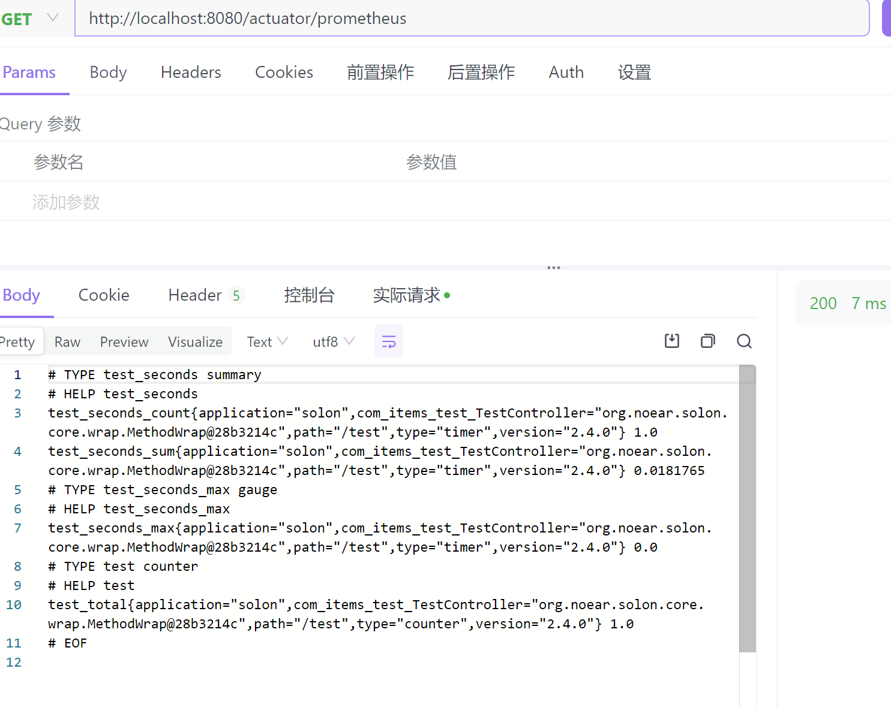
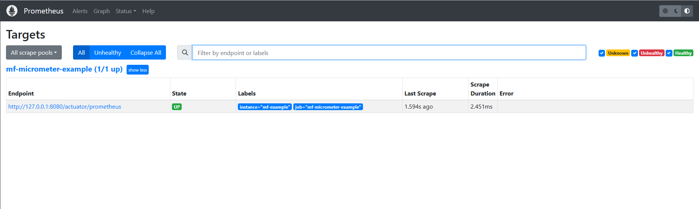

#### 快速入门

```xml
<dependency>
    <groupId>io.micrometer</groupId>
    <artifactId>micrometer-registry-prometheus</artifactId>
    <version>${micrometer.version}</version>
</dependency>
```

1.描述
基础扩展插件，为solon提供一个暴露站点,提供给micrometer进行数据分析。内置了一个计数器和计时器，为接口提供服务

2.配置参考

prometheus.yml

```yml
scrape_configs:
  - job_name: 'micrometer-example'
    scrape_interval: 5s
    metrics_path: '/metrics/prometheus'
    static_configs:
      - targets: ['127.0.0.1:8080']
        labels:
           instance: 'example1'
```

3.访问地址
http://localhost:8080/metrics/prometheus



4.搭配prometheus使用如下

